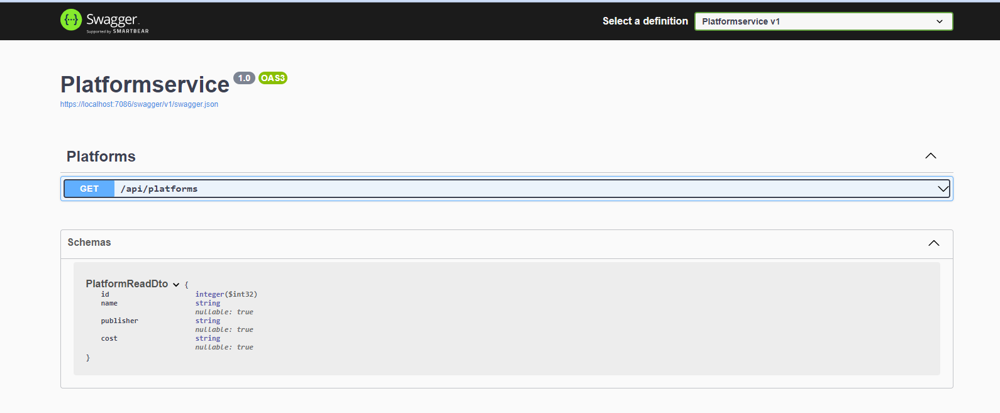
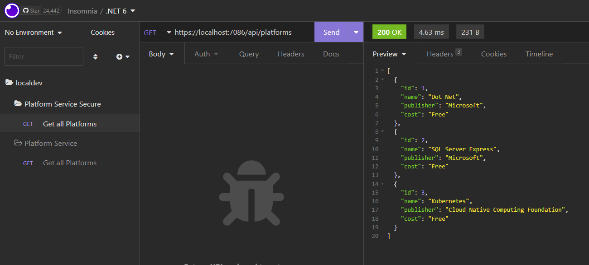
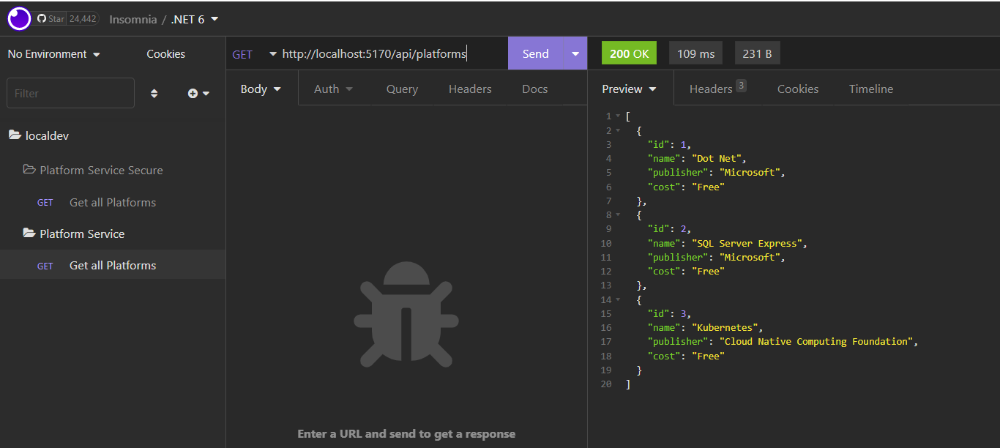

# microservices in .NET

for this we are going to build a .NET Core api in C# for the first time using vs-code. I have personally always created apis in Visual Studio, but for this course, we are going to look at using vs-code.

one thing that I definately like, is that instantly I can see that we get the use of prettier, which is awesome and something I have always bitched about Visual Studio. 

first we are going to install some packages. This is probably my initial first dislike of writing C# in vs-code. I still haven't figured out how to get all the other tooling that I get for free with Visual Studio, but oh well, it will probably come in due time.

```js
dotnet add package AutoMapper.Extensions.Microsoft.DependencyInjection
dotnet add package Microsoft.EntityFrameworkCore
dotnet add package Microsoft.EntityFrameworkCore.Design
dotnet add package Microsoft.EntityFrameworkCore.InMemory
dotnet add package Microsoft.EntityFrameworkCore.SqlServer
```

to build a project this way, you just have to run

```js
dotnet build
```

and to run the project

```js
dotnet run
```

for this first project, we are using an in memory database, linq to sql, which I actually hate, but I know a way around that, so once we get to the actual project where we are using sql, that will all change.

afer our first initial tests, I have the api running on both https and http:





time for our first .net Dockerfile

```js
FROM mcr.microsoft.com/dotnet/sdk:6.0 AS build-env

WORKDIR /app

COPY *.csproj ./

RUN dotnet restore

COPY . ./

RUN dotnet publish -c Release -o out

FROM mcr.microsoft.com/dotnet/aspnet:6.0

WORKDIR /app

COPY --from=build-env /app/out .

ENTRYPOINT ["dotnet", "Platformservice.dll"]

```

```js
docker build -t c5m7b4/platformservice .
```

```js
docker push c5m7b4/platformservice
```
