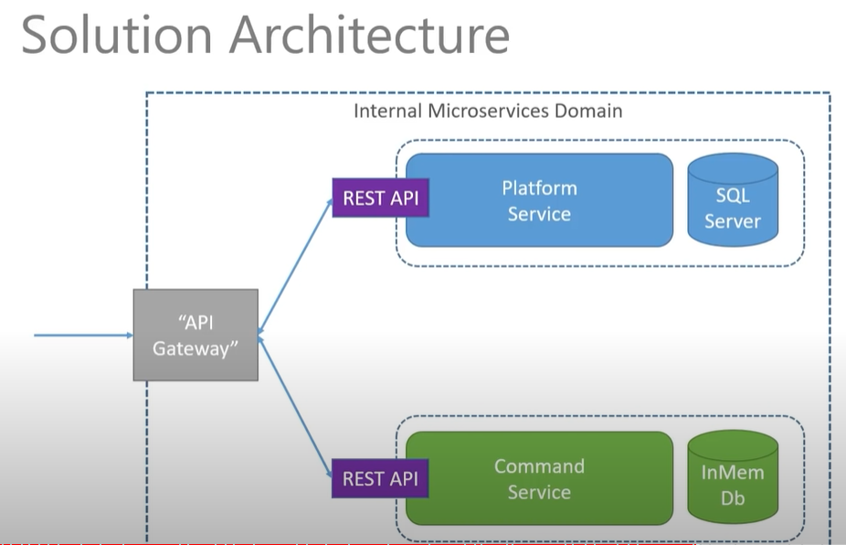
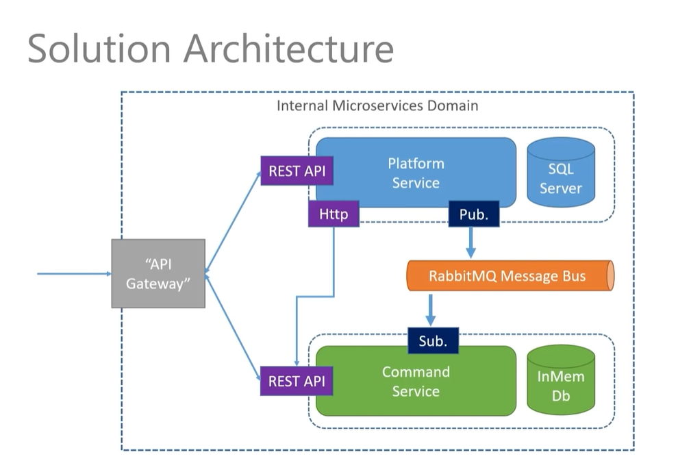
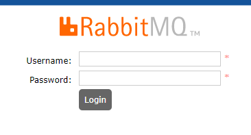
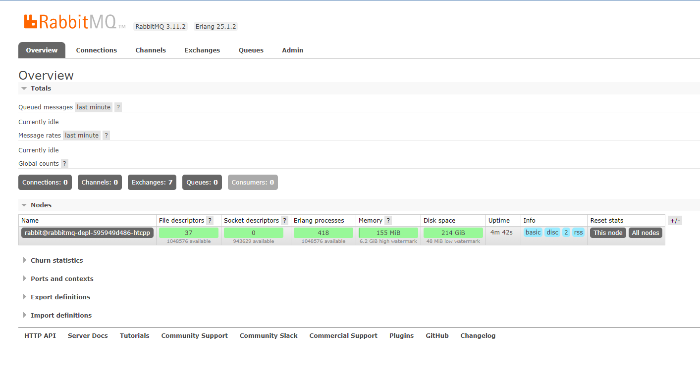

# microservices in .NET

for this we are going to build a .NET Core api in C# for the first time using vs-code. I have personally always created apis in Visual Studio, but for this course, we are going to look at using vs-code.

one thing that I definately like, is that instantly I can see that we get the use of prettier, which is awesome and something I have always bitched about Visual Studio. 

first we are going to install some packages. This is probably my initial first dislike of writing C# in vs-code. I still haven't figured out how to get all the other tooling that I get for free with Visual Studio, but oh well, it will probably come in due time.

```js
dotnet add package AutoMapper.Extensions.Microsoft.DependencyInjection
dotnet add package Microsoft.EntityFrameworkCore
dotnet add package Microsoft.EntityFrameworkCore.Design
dotnet add package Microsoft.EntityFrameworkCore.InMemory
dotnet add package Microsoft.EntityFrameworkCore.SqlServer
```

to build a project this way, you just have to run

```js
dotnet build
```

and to run the project

```js
dotnet run
```

for this first project, we are using an in memory database, linq to sql, which I actually hate, but I know a way around that, so once we get to the actual project where we are using sql, that will all change.

afer our first initial tests, I have the api running on both https and http:


time for our first .net Dockerfile

```js
FROM mcr.microsoft.com/dotnet/sdk:6.0 AS build-env

WORKDIR /app

COPY *.csproj ./

RUN dotnet restore

COPY . ./

RUN dotnet publish -c Release -o out

FROM mcr.microsoft.com/dotnet/aspnet:6.0

WORKDIR /app

COPY --from=build-env /app/out .

ENTRYPOINT ["dotnet", "Platformservice.dll"]

```

```js
docker build -t c5m7b4/platformservice .
```

```js
docker push c5m7b4/platformservice
```

## branch 1 - kubernetes

```js
kubectl version
```

our first kubernetes file

platforms-depl.yaml

```js
apiVersion: apps/v1
kind: Deployment
metadata:
  name: platforms-depl
spec:
  replicas: 1
  selector:
    matchLabels:
      app: platformservice
  template:
    metadata: 
      labels:
        app: platformservice
    spec:
      containers:
        - name: platformservice
          image: c5m7b4/platformservice:latest
```

then run this command

```js
kubectl apply -f platforms-depl.yaml
```

then 

```js
kubectl get deployments
```

```js
kubectl get pods
```

to tear it all down

```js
kubectl delete deployments platforms-depl
```

now we are going to add a nodePort

platforms-np-srv.yaml

```js
apiVersion: v1
kind: Service
metadata:
  name: platformnpservice-srv
spec:
  type: NodePort
  selector:
    app: platformservice
  ports:
    - name: platformservice
      protocol: TCP
      port: 80
      targetPort: 80
```

```js
kubectl apply -f platforms-np-srv.yaml
```

```js
kubectl get services
```

***************************************

CommandService

```js
dotnet new webapi -n CommandsService
```

cd into that and let's install some dependencies

```js
dotnet add package AutoMapper.Extensions.Microsoft.DependencyInjection
dotnet add package Microsoft.EntityFrameworkCore
dotnet add package Microsoft.EntityFrameworkCore.Design
dotnet add package Microsoft.EntityFrameworkCore.InMemory
```

you may have to run this on both services to get them to talk to each other

```js
dotnet dev-certs https --trust
```

to update a kubernetes deployment after a change has been made to the image

```js
kubectl rollout restart deployment platforms-depl
```

to create the secret

```js
kubectl create secret generic mssql --from-literal=MSSQL_SA_PASSWORD="pa55w0rd!"
```


to connect to sql, I had to use this for the server name
```js
localhost,1433
```

yes, that is a comma

username: sa
password: pa55w0rd!

when you get ready to create your migrations

```js
dotnet ef migrations add initialmigration
```

this is going to faile

if migrations faile try this
```js
dotnet new tool-manifest
dotnet tool install --local dotnet-ef --version 6.0.10
```

now the migrations command will still fail, so we need to do a few things to get this to work. comment out the reference to the inmemory database, and add our connectionstring to the dev appsettings file and remove the prepdb from ths startup file

```js
dotnet dotnet-ef migrations add initialmigration
``

now we should see this

```js
Build started...
Build succeeded.
--> running in production mode
info: Microsoft.EntityFrameworkCore.Infrastructure[10403]
      Entity Framework Core 6.0.10 initialized 'AppDbContext' using provider 'Microsoft.EntityFrameworkCore.SqlServer:6.0.10' with options: None

Done. To undo this action, use 'ef migrations remove'
``

and we should now have a migrations folder!!!!!

after we have that, we can umcomment the stuff we commented out

now we need to update our deployment

```js
kubectl rollout restart deployment platforms-depl
```

now we should see the migrations happening in our log from the platformservice
and if we check out database, it should be there with our one table


if everything is foobar you can always run

```js
kbectl delete deployment platforms-depl
```

## branch 2

Ok, so, here is where we are so far, but we need more pieces to really make this work:



This is where we are going to go next:



need to check out ampq - advanced messaging and queueing protocol

our rabbitmq yaml file looks like this:

```js
apiVersion: apps/v1
kind: Deployment
metadata:
  name: rabbitmq-depl
spec:
  replicas: 1
  selector:
      matchLabels:
        app: rabbitmq
  template:
    metadata:
      labels:
        app: rabbitmq
    spec:
      containers:
        - name: rabbitmq
          image: rabbitmq:3-management
          ports:
            - containerPort: 15672
              name: rbmq-mgmt-port
            - containerPort: 5672
              name: rbmq-msg-port
---
apiVersion: v1
kind: Service
metadata:
  name: rabbitmq-clusterip-srv
spec:
  type: ClusterIP
  selector:
    app: rabbitmq
  ports:
  - name: rbmq-mgmt-port
    protocol: TCP
    port: 15672
    targetPort: 15672   
  - name: rbmq-msg-port
    protocol: TCP
    port: 5672
    targetPort: 5672
---
apiVersion: v1
kind: Service
metadata:
  name: rabbitmq-loadbalancer
spec:
  type: LoadBalancer
  selector:
    app: rabbitmq
  ports:
  -  name: rbmq-mgmt-port
     protocol: TCP
     port: 15672
     targetPort: 15672   
  -  name: rbmq-msg-port
     protocol: TCP
     port: 5672
     targetPort: 5672       
```

now we can spin that up

```js
kubectl apply -f rabbitmq-depl.yaml
```

then we can go to a browser and put in this address: http://localhost:15672/

to login just use guest and guest as the username and password respectively



and here is our rabbit dashboard



## branch 3

now it time to publish some events to rabbitmq

open up the Platforms project and install these dependencies

```js
dotnet add package RabbitMQ.Client
```


next up we added out MessageBusClient and ran our tests with insomnia

